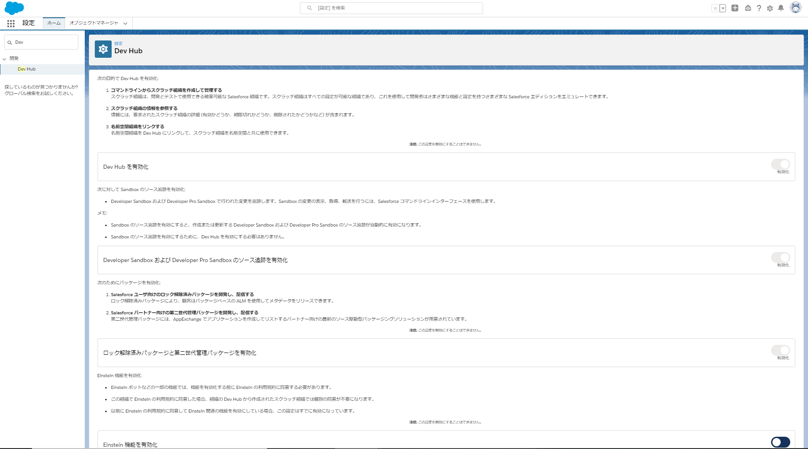

# SFDXお試し

SFDXによるソースコードベースの開発を目的として検証

## SFDX化によるメリット
* 各環境間での想定外の差分がシステム的に担保
  * テストしたソース = 本番で動くソース
* メンバー間での変更の競合を検知できる
* リリースフローが統一されるため、リリース毎に手順書を作成する必要がなくなる
  * CI/CDなどで、リリース自動化することでソースを担保可能
* 変更箇所や経緯を履歴と紐づけて管理・集約可能

## 設定手順

### 0. 環境
* 本番組織
  * Developer Editionを利用
* salesforce CLI
  * npmよりインストール
* Git
* VScode

### 1. DevHubの有効化
スクラッチ組織を有効化するためにDevHubの設定を更新



### 2. ローカル環境にプロジェクトを作成

* 以下のコマンドを実行し、起動したブラウザタブよりDevHubを設定した組織へログイン
  ```bash
  > sfdx force:auth:web:login -a [任意の環境名]
  ``` 
    * 任意の環境名: ログインした情報をエイリアスとして保持するために任意で指定

* ローカルにSFDXプロジェクトを作成する
  * ①新規プロジェクトの場合:
    ```bash
    > sfdx force:project:create -n [任意プロェクト名]
    ```
    * 任意のプロジェクト名: プロジェクトフォルダ名として作成されます
  * ②既存プロジェクトの場合:
    * [これら](https://developer.salesforce.com/docs/atlas.ja-jp.230.0.sfdx_dev.meta/sfdx_dev/sfdx_dev_ws_create_from_existing.htm)のドキュメント参考プロジェクトを落としてくる

### 3. scratch組織の起動 ~ 変更

* スクラッチ組織を作成する
  ```bash
  > sfdx force:org:create -s -f config/project-scratch-def.json -a [任意のスクラッチ組織名]
  ```
    * 任意のスクラッチ組織名: 作成しスクラッチ組織名をエイリアスとして保持するために任意で指定

* スクラッチ組織を起動してログイン
  ```bash
  > sfdx force:org:open -u [スクラッチ組織名]
  ```
    * ↑で指定したスクラッチ組織名を指定してログイン

* 通常と同じ手順でUIより設定が変更可能

### 4. ローカルへの反映

* UIからの設定変更後、下記のコマンドでローカルへ反映
  ```bash
  > sfdx force:source:pull
  ```

* 変更をGitへプッシュすることで、ソースコードベースの開発が可能に

## APPENDIX

### 運用フロー


### CI/CDフロー
Sandbox/本番環境へのリリースをCI/CD化する際の処理イメージ

1. リリース環境(Sandbox/本番環境)へログイン
  ```bash
  > 
  ```
  * TBU : 

2. VCSからソースコードをローカルにクローン/プル
  ```bash
  > 
  ```
③ソース形式をメタデータ形式に変換する
sfdx force:source:convert -d <ディレクトリ名>

③Sandbox/本番環境へリリース
sfdx force:mdapi:deploy -d <ディレクトリ名> -u <リリース環境(Sandbox/本番環境)の別名>


### 参考文献
* [Qiita記事](https://qiita.com/yhayashi30/items/80dd868f2e15aac67072)
