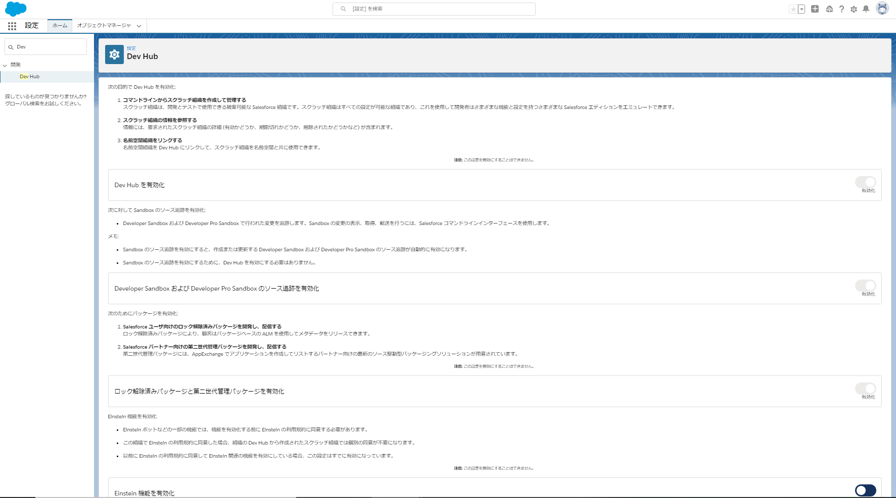

# SFDX検証の結果

SFDXによるソースコードベースの開発を目的として検証

## アジェンダ

* [1. 環境](#1-環境)
* [2. スクラッチ環境導入設定手順](#2-スクラッチ環境導入設定手順)
* [3. APPENDIX](#3-appendix)
* [4. Tips](#4-tips)

## 1. 環境

本検証時に使用した環境情報

* Salesforce本番組織
  * Salesforce Developer Edition
    * URL: https://scsk72-dev-ed.lightning.force.com
  * サービスアカウント
    * user: jenkins@service.dev.com
    * pass: [XXXXXX](../jenkins-sample/certifications/memo.md)
* salesforce CLI
  * sfdx-cli/7.102.0 darwin-x64 node-v16.1.0
* Git
  * git version 2.30.1 (Apple Git-130)
* VScode
  * Version: 1.56.2 (Universal)
* Gitlab
* Docker
  * Docker version 20.10.6, build 370c289
* Docker Compose
  * docker-compose version 1.29.1, build c34c88b2

## 2. スクラッチ環境導入設定手順

|No.|項目||①初期設定時|②設定済み + ソースがGit管理されている場合|③設定済み + ローカルにソース保管済み|
|---|---|---|:---:|:---:|:---:|
|2-1|[DevHubの有効化](#2-1-devhubの有効化-初回のみ)||●|||
|2-2|[ローカル環境にプロジェクトを作成](#2-2-ローカル環境にプロジェクトを作成)||●|● ※③||
|2-3|[スクラッチ組織の起動〜変更](#2-3-スクラッチ組織の起動変更)||●|●|●|
|2-4|[ソースへの反映](#2-4-ソースへの反映)||●|●|●|
|2-X|[オプション：JWTベアラーフロー認証の設定](#2-x-jwtベアラーフロー認証の設定)||●|||

### 2-1. DevHubの有効化 (初回のみ)

スクラッチ組織を有効化するためにDevHubの設定を更新

* 設定 > クイック検索: Dev Hub



### 2-2. ローカル環境にプロジェクトを作成

__①新規プロジェクトに導入する場合：__

* 下記のコマンドより、SFDXプロジェクトを作成

  ```bash
  sfdx force:project:create -n [任意プロェクト名]
  ```

  * 任意のプロジェクト名: プロジェクトフォルダ名として作成されます

__②既存プロジェクトに導入する場合：__

* [こちら](https://developer.salesforce.com/docs/atlas.ja-jp.230.0.sfdx_dev.meta/sfdx_dev/sfdx_dev_ws_create_from_existing.htm)のドキュメントを参考に、既存プロジェクトのソースをローカルへ反映

__③既にGit管理しているプロジェクトがある場合：__

* Gitリポジトリより、ソースをクローンしローカルに反映

  ```bash
  git clone [任意のSFDX管理プロジェクト]
  ```

### 2-3. スクラッチ組織の起動〜変更

1. DevHubを設定した組織へログイン

    以下のコマンドを実行し、起動したブラウザタブよりDevHubを設定した組織へログイン

    ```bash
    sfdx force:auth:web:login -d -a [任意の環境名]
    ```

    * 任意の環境名: ログインした情報をエイリアスとして保持するために任意で指定

1. スクラッチ組織を作成

    ```bash
    sfdx force:org:create -s -f config/project-scratch-def.json -a [任意のスクラッチ組織名]
    ```

    * 任意のスクラッチ組織名
      * 作成しスクラッチ組織名をエイリアスとして保持するために任意で指定
<br>
1. ローカルのソースを反映

    ```bash
    sfdx force:source:push
    ```

    * スクラッチ組織が複数ある場合には、
<br>
1. スクラッチ組織を起動

    ```bash
    sfdx force:org:open -u [スクラッチ組織名]
    ```

    * 1.で指定したスクラッチ組織名を指定してログイン
<br>
1. 通常と同じ手順でUIより設定を変更

### 2-4. ソースへの反映

1. UIからの設定変更後、下記のコマンドでローカルのソースへ反映

    ```bash
    sfdx force:source:pull
    ```

1. ローカルに反映された変更をコミット

    ```bash
    git commit
    ```

1. コミットをリモートリポジトリへ反映

    ```bash
    git push origin [任意のブランチ]
    ```

<br>

`オプション`

### 2-X. JWTベアラーフロー認証の設定

* CI/CDでCLIベースの認証を可能にする場合に設定が必要
* Salesforceの本番組織上で、下記よりJWTベアラーフロー認証設定を実施
  * 設定　⇨　Lightning Experience アプリケーションマネージャ ⇨ 新規接続アプリケーション
  * 設定の詳細は[こちら](https://developer.salesforce.com/docs/atlas.ja-jp.sfdx_dev.meta/sfdx_dev/sfdx_dev_auth_jwt_flow.htm)を参考にください
* こちらの設定で使用した `server.key` ファイルは、CI/CD設定で使用するため、保管ください
* こちらの設定で生成された `コンシューマーキー` は、CI/CD設定で使用するため、保管ください

## 3. APPENDIX

### 3-1. CI/CDフロー案

* [こちら](./cicd-varification.md)を参照ください

### 3-2. 参考文献

* [SFDX初期導入リファレンス](https://qiita.com/yhayashi30/items/80dd868f2e15aac67072)

### 3-3. 課題

* 別途、SFDX検証管理シートの課題に記載しています。

## 3-4. Demo

デモシナリオは、[こちら](./demo.md)

## 4. Tips

検証進める上でつまづいたところと、その解消方法を下記にまとめ

### 4-1. スクラッチ組織の作成ができない。。。 (1)

```bash
sfdx force:org:create -s -f config/project-scratch-def.json -a scratch

# Error message
ERROR running force:org:create:  This command requires a dev hub org username set either with a flag or by default in the config.
```

<details>
<summary>解決方法</summary>

* ログイン情報が正しくない可能性があります。再度下記のコマンドよりログインしてください。

  ```bash
  sfdx force:auth:web:login -d -a [任意の環境名]
  ```

</details>

### 4-2. スクラッチ組織の作成ができない。。。 (2)

```bash
sfdx force:org:create -s -f config/project-scratch-def.json -a scratch

# error message
ERROR running force:org:create:  この組織は有効なスクラッチ組織の制限に達したため、サインアップ要求に失敗しました
```

<details>
<summary>解決方法</summary>

* スクラッチ組織が作成上限に達していると思われます。DevHub設定をした組織より、不要なスクラッチ組織を削除ください。
  * 手順
    1. DevHub組織を設定した環境へUIでログインします。
    2. アプリケーションランチャーから`有効なDevHub組織`を検索します。
    3. レコードの件数がスクラッチ組織を作成可能な上限に達している場合、不要と思われる組織を削除します。
        * [Edition毎のスクラッチ組織最大数](https://developer.salesforce.com/docs/atlas.ja-jp.230.0.sfdx_dev.meta/sfdx_dev/sfdx_dev_scratch_orgs_editions_and_allocations.htm)
        * 下記のコマンドで現在の使用状況を確認可能です。

          ```bash
          sfdx force:limits:api:display -u [設定したDevHubのエイリアス名]
          ```

</details>

### 4-3. スクラッチ組織の作成ができない。。。 (3)

```bash
sfdx force:org:create -s -f config/project-scratch-def.json -a scratch

# Error message
ERROR running force:org:create:  You do not have access to the [ScratchOrgInfo] object
```

<details>
<summary>解決方法</summary>

* スクラッチ組織を作成する権限がないユーザーでログインしていると思われます。下記コマンドより、再度認証お試しください。
  
  ```bash
  sfdx force:auth:web:login -d -a [任意の環境名]
  ```

</details>

### 4-4. メタデータAPIリリース時に一部のパーミッションが存在しないと弾かれてしまう。。。

```bash
sfdx force:mdapi:deploy -w -1 -d ./release -u sfdx --testlevel=RunLocalTests

# Error message
Error  release/profiles/Custom%3A Marketing Profile.profile  Custom%3A Marketing Profile  Unknown user permission: ManageCssUsers
Error  release/profiles/Custom%3A Sales Profile.profile      Custom%3A Sales Profile      Unknown user permission: ManageCssUsers
Error  release/profiles/Custom%3A Support Profile.profile    Custom%3A Support Profile    Unknown user permission: ManageCssUsers
```

<details><summary>解決方法</summary>

* スクラッチ組織と本番組織/サンドボックスのデフォルトのプロファイル設定が異なる模様。([参考](https://developer.salesforce.com/forums/?id=9060G0000005WHjQAM))

* 検証時点では、自動化に組み込み可能なワークアラウンドを見つけられていないため、下記をコメントアウトして、再度リリース下さい。
  * ※下記は既知のものです。その他にエラー出現するものありましたら、ご追加お願いします。

|ファイル名|項目名|備考|
|---|---|---|
|Admin.profile-meta.xml|CreateWorkBadgeDefinition||
|Admin.profile-meta.xml|FieldServiceAccess||
|Admin.profile-meta.xml|ManagePartners||
|Admin.profile-meta.xml|SendExternalEmailAvailable||
|Custom%3A Marketing Profile.profile-meta.xml|ManageCssUsers||
|Custom%3A Marketing Profile.profile-meta.xml|ViewGlobalHeader||
|Custom%3A Sales Profile.profile-meta.xml|ManageCssUsers||
|Custom%3A Sales Profile.profile-meta.xml|ViewGlobalHeader||
|Custom%3A Support Profile.profile-meta.xml|ManageCssUsers||
|Custom%3A Support Profile.profile-meta.xml|ViewGlobalHeader||

</details>

### 4-5. Sonar Qubeにプラグイン導入するとエラーで落ちてしまう。。。

```bash
2021.06.16 06:19:22 ERROR ce[][o.s.ce.app.CeServer] Compute Engine startup failed
java.lang.IllegalStateException: Fail to unzip plugin [codescanlang] /opt/sonarqube/extensions/plugins/sonar-codescanlang-plugin-4.5.6.jar to /opt/sonarqube/temp/ce-exploded-plugins/codescanlang
```

<details><summary>解決方法</summary>

* UnZipに失敗している模様だが、原因特定まで至らず。。。
* ただし、Dockerの許容メモリを2GBから4GBにあげることで解消すること確認。

⇨　Dockerの許容メモリ上限設定の変更をお試しください。

</details>
