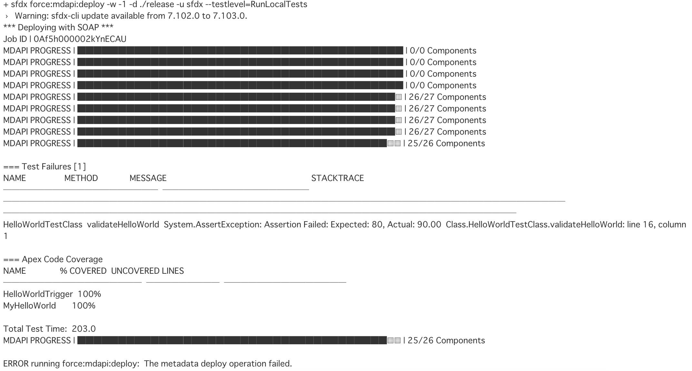

# テスト自動化検証

Salesforceに適用可能なテスト自動化ツールを検証する目的

## 0. アジェンダ

* [1. Salesforce標準Apexテスト](1-salesforce標準apexテスト)
* [2. 静的解析テスト](2-静的解析テスト)
* 

## 1. Salesforce標準Apexテスト

Apexのテストクラス実行を調査

### 1-1. ApexTestの実行

CI/CDに適用可能なテストコマンドは下記。

```bash
sfdx force:mdapi:deploy -w '-1' -d ./release -u sfdx --testlevel=RunLocalTests
```

* --testlevel : RunLocalTest指定でリリース時にApexテストを実行。
  * テストが失敗した場合は、リリースが失敗
    

<br>

<details><summary>備考：</summary>

下記の通り、テストコマンドが存在するが、CI/CDには適用難しい。

```bash
sfdx force:apex:test:run --synchronous -w -1 -c -v -r human --testlevel=RunLocalTests -u [ユーザー]
```

* 環境上でテスト実行するため、リリース前のモジュールに対するテストは不可。
  * 従って、CI/CD時のテストとしては不適。各自がスクラッチ組織上でテスト書いた際に実行するコマンドとして運用推奨。
* スクラッチ組織を利用して、単体テスト実行環境を作成する方法もあるが、スクラッチ組織に作成上限がある関係から、適用は現実的でない認識。

</details>

<br>

## 2. 静的解析テスト

調査対象洗い出し

|No.|ツール名|無料枠有無|特徴|参考価格|対象|備考|
|---|---|---|---|---|---|---|
|1|[code.scan](https://www.codescan.io/)|？|sonarcubeのPluginとして利用可能。|?|Apex, meta-data, visual force|Cloud版とSelf-Host版有り|
|2|[Clayton](https://www.getclayton.com/)|？|リポジトリ登録型でプリリクエストで指摘、提案してくれる模様|最低$540/月|Apex||
|3|[PMD Apex](https://github.com/pmd/pmd)|OSS|無料|Apex||
|4|[salesforce-sonar-plugin](https://github.com/SalesforceFoundation/salesforce-sonar-plugin)|OSS|無料|Apex|pmdを利用。対象Apexのみ|

* Sonar Cubeとの親和性の観点から、`code.scan`をメインで調査

### 2-1. Sonar cubeの設定・起動

* docker-composeにsonar-cubeを追加。
  * [docker-compose.yml](../jenkins-sample/docker-compose.yml)
* 下記で起動してログイン
  
  ```bash
  docker-compose up -d
  ```

  * ユーザーはデフォルトで存在する以下を使用
    * user: admin, pass: admin

|key|value|備考|
|---|---|---|
|project key|sfdx-sample||
|token(name)|sfdx-sample-codescan||
|token(val)|[XXX](../jenkins-sample/certifications/memo.md)|※ドキュメント参照|

* Sonar Scannerの導入
  * 検証用でローカルに導入 ([参考](https://docs.sonarqube.org/latest/analysis/scan/sonarscanner/))
  * プロジェクトのルートにsonar-project.propertiesを追加
  * sfdxのプラグインを利用する場合は、インストール不要

### 2-2. Code scanインストール

__①SonarQubeのプラグインインストール__

* SonarQubeコンテナ内のpluginsディレクトリ内にjarファイルを配置
  * /opt/sonarqube/extensions/plugins/sonar-salesforce-plugin-4.5.6.jar
  * /opt/sonarqube/extensions/plugins/sonar-codescanlang-plugin-4.5.6.jar
* コンテナを再起動
* Administration > Configuration > CodeScanが表示されていればインストール完了
  * CodeScanの利用には、[ライセンスの申請と設定](https://docs.codescan.io/hc/en-us/articles/360011885512-Installing-CodeScan-Self-Hosted)が必要

__②SFDXのプラグインインストール__

```bash
sfdx plugins:install sfdx-codescan-plugin
```

### 2-3. Code scanの実行


## X. リファレンス

* [Salesforce向けテストツール一覧](https://qiita.com/a_kuratani/items/0f832379d2fda3888c11)
